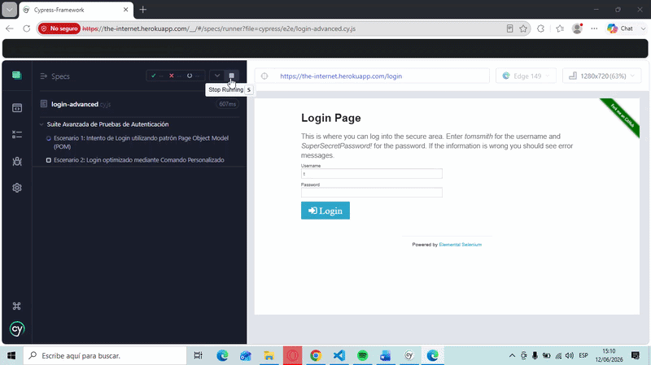
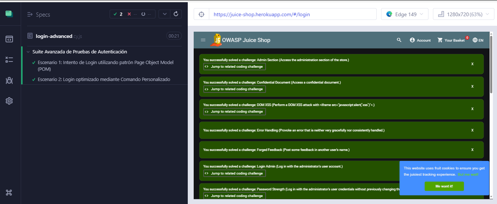

# 🧪 Cypress E2E Automation Framework

<div align="center">

### 🚀 Framework de Automatización de Pruebas End-to-End con Cypress

Diseñado utilizando **Page Object Model (POM)**, **Custom Commands** y una arquitectura modular orientada a la mantenibilidad, reutilización y escalabilidad.

<br>

[](https://www.cypress.io/)
[](https://developer.mozilla.org/es/docs/Web/JavaScript)
[](https://nodejs.org/)
[](https://martinfowler.com/bliki/PageObject.html)

</div>

---

## 📊 Estadísticas del Repositorio

<div align="center">


</div>

---

# 📖 Acerca del Proyecto

Este proyecto demuestra la construcción de un framework profesional de automatización de pruebas **End-to-End (E2E)** utilizando Cypress.

La solución fue desarrollada aplicando patrones de diseño y buenas prácticas ampliamente utilizadas en la industria para garantizar:

* ✅ Reutilización de código
* ✅ Fácil mantenimiento
* ✅ Escalabilidad
* ✅ Separación de responsabilidades
* ✅ Legibilidad de las pruebas

Su propósito es servir como evidencia práctica de conocimientos en automatización de pruebas, diseño de frameworks y arquitectura de pruebas modernas.

---

# 🎥 Demostración

<div align="center">



</div>

# 📸 Evidencia de Ejecución

<div align="center">



</div>


---

# ✨ Características Principales

* 🏛️ Page Object Model (POM)
* ⚙️ Custom Commands
* 📂 Gestión de Fixtures
* 🧩 Arquitectura Modular
* 🛡️ Pruebas Resilientes
* 🧪 Automatización End-to-End
* ♻️ Código Reutilizable
* 📈 Fácil Escalabilidad

---

# 🛠️ Tecnologías Utilizadas

| Tecnología      | Propósito                |
| --------------- | ------------------------ |
| Cypress         | Automatización E2E       |
| JavaScript ES6+ | Desarrollo del framework |
| Node.js         | Entorno de ejecución     |
| Git             | Control de versiones     |
| GitHub          | Gestión del repositorio  |

---

# 🏗️ Estructura del Proyecto

```text
cypress-framework/
│
├── cypress/
│   ├── fixtures/
│   │   └── user-data.json
│   │
│   ├── page-objects/
│   │   └── LoginPage.js
│   │
│   ├── e2e/
│   │   └── login-advanced.cy.js
│   │
│   └── support/
│       ├── commands.js
│       └── e2e.js
│
├── cypress.config.js
├── package.json
└── README.md
```

---

# 📂 Organización de Carpetas

| Carpeta             | Descripción                                    |
| ------------------- | ---------------------------------------------- |
| `fixtures`          | Datos de prueba                                |
| `page-objects`      | Implementación del patrón POM                  |
| `e2e`               | Casos de prueba automatizados                  |
| `support`           | Configuración global y comandos personalizados |
| `cypress.config.js` | Configuración principal del framework          |

---

# 🧪 Casos de Prueba Implementados

### ✅ Login Exitoso

Valida el acceso utilizando credenciales válidas.

### ✅ Login Fallido

Verifica el comportamiento esperado ante credenciales inválidas.

---

# 📸 Evidencia de Ejecución

La siguiente captura muestra la ejecución exitosa de los escenarios automatizados.

```markdown

```

---

# 🚀 Instalación

## Clonar el repositorio

```bash
git clone https://github.com/Danielito2252/Cypress-Framework.git
```

## Ingresar al proyecto

```bash
cd Cypress-Framework
```

## Instalar dependencias

```bash
npm install
```

---

# ▶️ Ejecución de las Pruebas

## Modo Interactivo

```bash
npm run cypress:open
```

Permite visualizar la ejecución de los escenarios en tiempo real.

---

## Modo Headless

```bash
npm run cypress:run
```

Ideal para ejecuciones rápidas desde terminal.

---

# 📚 Buenas Prácticas Aplicadas

* ✔️ Page Object Model (POM)
* ✔️ Principio DRY
* ✔️ Reutilización de código
* ✔️ Separación de datos de prueba
* ✔️ Modularidad
* ✔️ Escalabilidad
* ✔️ Mantenibilidad
* ✔️ Legibilidad del código

---

# 👨‍💻 Autor

## Herberth Barrios

**QA Automation Engineer | Software Developer**

🔗 LinkedIn

https://www.linkedin.com/in/herberth-barrios-299236261/

🔗 GitHub

https://github.com/Danielito2252

---

# ⭐ Sobre este Repositorio

Este proyecto forma parte de mi portafolio profesional y tiene como objetivo demostrar conocimientos en:

* Automatización de pruebas E2E
* Cypress Framework Design
* Page Object Model
* Custom Commands
* Arquitectura de pruebas escalable
* Buenas prácticas de QA Automation

Si el proyecto te resulta útil o interesante, considera darle una ⭐ al repositorio.

---

<div align="center">

### 🚀 Quality Assurance Through Automation

Construyendo software más confiable mediante pruebas automatizadas.

</div>
